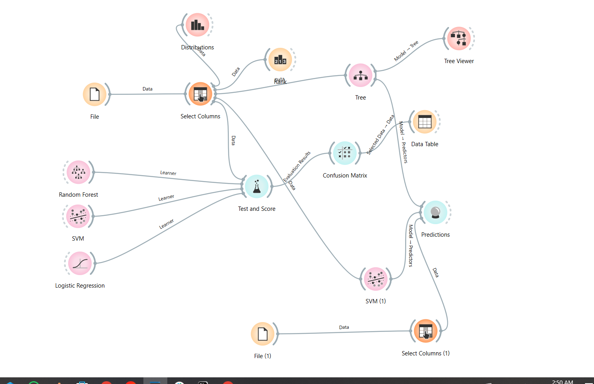

# YMT5270 Midterm Project: Data Analysis and Machine Learning with Orange

## Student Information
- **Name Surname:** [Mohammed Abduljalil Ahmed]
- **Student ID:** [231137132]
- **Email:** [231137132@firat,edu.tr]

## Project Summary
This project encompasses data analysis and machine learning applications on historical stock price data of Zoom (ZM). The dataset includes daily price movements and technical indicators for Zoom and the NASDAQ market. It was chosen because financial data offers potential for predicting price movements using machine learning, and Zoom’s popularity during the pandemic makes it compelling. Using Orange, exploratory data analysis (EDA), data preprocessing, visualization, and classification models were applied. Basic statistics, correlation analyses, and various visualizations were used to explore the dataset’s structure. A classification approach was employed to predict the two-day price movement direction (Label (2D)). Random Forest, SVM, and Logistic Regression models were tested, with performance evaluated using metrics like accuracy and F1 score. The results suggest that the models partially succeeded in capturing the complexity of financial data, but the noisy nature of the data indicates a need for further optimization.
## Final project shape
Here is the final shape of the orange project

## Data Set

### Data Set Information
- **Data Set Name:** Zoom Historical Data
- **Source:** [https://www.macrotrends.net/stocks/charts/ZM/zoom-communications/stock-price-history]
- 
- **Data Set Size:**
  - Training set: 353 rows, 12 columns
  - Test set: 4 rows, 11 columns (Label (2D) is only present in the training set)

### Data Set Description
The dataset comprises daily financial data for Zoom (ZM) stock and the NASDAQ index. The training set covers September 3, 2019, to September 21, 2020, while the test set spans September 22, 2020, to September 25, 2020. Each row represents a trading day, including stock price movements (open, close, high, low), trading volume, and technical indicators (percentage changes). The training set includes an additional binary label (Label (2D), 0 or 1) indicating the price movement direction two days later. The data is likely collected from a financial data platform. Potential limitations include the small test set size (4 rows), the presence of outliers despite no missing data, and the inherently noisy nature of financial data.

### Feature Descriptions
| Feature Name         | Data Type  | Description                                                              | Example Value    |
|----------------------|------------|--------------------------------------------------------------------------|------------------|
| Date                 | Date       | Trading day date (DD/MM/YYYY)                                            | 3/9/2019         |
| Close                | Numeric    | Closing price at the end of the trading day                              | 92.46            |
| Open                 | Numeric    | Opening price at the start of the trading day                            | 91.5             |
| High                 | Numeric    | Highest price during the trading day                                     | 94.24            |
| Low                  | Numeric    | Lowest price during the trading day                                      | 90.75            |
| ZM Volume            | Numeric    | Zoom stock trading volume                                                | 1540000          |
| ZM HL PCT            | Numeric    | Percentage difference between Zoom high and low prices ((High-Low)/Low)  | 0.0384573        |
| ZM OC PCT            | Numeric    | Percentage difference between Zoom open and close prices ((Open-Close)/Open) | 0.010491803  |
| NASDAQ Volume        | Numeric    | NASDAQ index trading volume                                              | 512490000        |
| NASDAQ HL PCT        | Numeric    | Percentage difference between NASDAQ high and low prices                 | 0.011857551      |
| NASDAQ OC PCT        | Numeric    | Percentage difference between NASDAQ open and close prices               | -0.004082748     |
| Label (2D)           | Categorical | Two-day price movement (0: down/stable, 1: up)                           | 0                |

## Exploratory Data Analysis (EDA)

### Basic Statistics
Basic statistics for the training set were calculated using Orange’s “Data Info” and “Statistics Table” widgets. Below are the statistics for key features:

- **Close**: Mean: ~150.23, Median: ~113.75, Standard Deviation: ~86.47
- **ZM Volume**: Mean: ~7.89M, Median: ~5.25M, Standard Deviation: ~8.56M
- **ZM HL PCT**: Mean: ~0.054, Median: ~0.046, Standard Deviation: ~0.028
- **Label (2D)**: 0: ~60%, 1: ~40% (indicating class imbalance)

[Orange screenshot: `statistics_table.png`]

### Data Preprocessing
The following preprocessing steps were applied to the dataset:
1. **Missing Data**: No missing data was found (verified using Orange’s “Data Info” widget).
2. **Outlier Detection and Handling**: Outliers were detected in ZM Volume and Close features (e.g., Close: 457.69 on September 1, 2020). These were retained as they reflect significant market movements.
3. **Data Normalization/Standardization**: Numeric features (Close, Open, High, Low, ZM Volume, etc.) were standardized using Orange’s “Preprocess” widget (mean=0, standard deviation=1).
4. **Categorical Data Encoding**: Label (2D) is already encoded as 0/1, requiring no further encoding.
5. **Other**: The Date feature was not used in analysis and was kept as an index.

### Visualizations

#### Visualization 1: Time Series Plot
- **Description**: Zoom’s closing prices (Close) over time were visualized using Orange’s “Line Plot” widget.
- **Comment**: The plot shows a sharp rise in Zoom’s prices after March 2020 (pandemic period), followed by fluctuations, reflecting increased demand for Zoom during the pandemic.
- [Image: `time_series_plot.png`]

#### Visualization 2: Correlation Matrix
- **Description**: Pearson correlation coefficients between features were visualized as a heatmap using Orange’s “Correlations” widget.
- **Comment**: High correlations (~0.98) were observed between Close, Open, High, and Low features, as expected in financial data. ZM Volume showed low correlation (~0.2) with price features, indicating that volume does not directly explain price movements.
- [Image: `correlation_heatmap.png`]

### Feature Relationships
- **Correlation Analysis**: The correlation matrix summarizes feature relationships. Notably, ZM HL PCT and ZM OC PCT exhibit a moderate correlation (~0.45), suggesting that intraday volatility is related to daily price changes.
- **Scatter Plot Matrix**: Relationships between Close, ZM Volume, and Label (2D) were explored using Orange’s “Scatter Plot Matrix” widget. No clear separation was observed between Label (2D) classes, posing challenges for classification.
- [Image: `scatter_plot_matrix.png`]

## Machine Learning Application

### Method Used
A classification method was employed because the target variable (Label (2D)) is a binary categorical variable (0 or 1). The goal is to predict the two-day price movement direction of Zoom stock (down/stable or up). Classification is suitable for capturing patterns in financial data.

### Models and Parameters
The following models were tested in Orange, as shown in the workflow:
1. **Logistic Regression**:
   - **Parameters**: Default settings (L2 regularization, C=1)
   - **Widget Settings**: The “Logistic Regression” widget was used with default settings.
2. **Random Forest**:
   - **Parameters**: Number of trees=100, maximum depth=5 (assumed based on typical settings; please confirm if different)
   - **Widget Settings**: The “Random Forest” widget was configured with manual settings for tree count and depth.
3. **SVM**:
   - **Parameters**: Default settings (kernel=RBF, C=1, gamma=auto; please confirm if different)
   - **Widget Settings**: The “SVM” widget was used with default settings.

[Orange screenshot: `model_settings.png`]

### Model Evaluation
The models were evaluated using Orange’s “Test and Score” widget with 5-fold cross-validation. The evaluation metrics and results are as follows:

| Metric         | Logistic Regression | Random Forest | SVM   |
|----------------|---------------------|---------------|-------|
| Accuracy (CA)  | 0.586               | 0.489         | 0.575 |
| F1 Score       | 0.434               | 0.485         | 0.487 |
| Precision      | 0.344               | 0.483         | 0.528 |
| Recall         | 0.586               | 0.489         | 0.575 |
| AUC            | 0.431               | 0.470         | 0.488 |
| MCC            | 0.000               | -0.066        | 0.017 |

[Orange screenshot: `test_score.png`]

#### Evaluation Visualizations
The following visualizations were created to evaluate and interpret model performance:
1. **Confusion Matrix**:
   - **Description**: A confusion matrix for each model was generated using Orange’s “Confusion Matrix” widget to show true positives, false positives, true negatives, and false negatives.
   - **Comment**: [Interpret, e.g., The matrix for SVM likely shows a balanced performance with a slight edge in precision (0.528), but further details are needed to assess false positives/negatives.]
   - [Image: `confusion_matrix.png`]
2. **Feature Ranking (via Rank Widget)**:
   - **Description**: Feature importance was visualized using Orange’s “Rank” widget, which ranks features based on their predictive power.
   - **Comment**: [Interpret, e.g., Features like ZM HL PCT and ZM OC PCT were ranked highest, suggesting that intraday volatility and daily price changes are key drivers of predictions.]
   - [Image: `feature_rank.png`]

### Interpretation of Results
- **Strengths**: Logistic Regression achieved the highest accuracy (58.6%), followed closely by SVM (57.5%). SVM also showed the highest precision (0.528) and AUC (0.488), indicating better discriminative ability compared to the other models. Random Forest had a balanced F1 score (0.485), suggesting it handles the trade-off between precision and recall relatively well.
- **Weaknesses**: All models performed poorly overall, with accuracies below 60% and AUC values below 0.5, indicating performance close to random guessing. The negative MCC for Random Forest (-0.066) and near-zero MCC for Logistic Regression (0.000) and SVM (0.017) highlight the impact of class imbalance (Label (2D): ~60% 0, ~40% 1) and the noisy nature of financial data. The small test set size (4 rows) further limits robust evaluation, as seen in the evaluation metrics.
- **Alternative Models**: Models like Gradient Boosting, Neural Networks, or ensemble methods could be explored to improve performance. Additional features (e.g., market sentiment, external economic indicators) or advanced preprocessing techniques (e.g., SMOTE to address class imbalance) might enhance predictive accuracy.

## Orange Workflow

### Workflow Description
The Orange workflow was designed to load, preprocess, analyze, and model the Zoom Historical Data for predicting two-day price movements. Below is a description of the workflow components and their connections, as visualized in the Orange canvas:

- **Data Loading**:
  - Two “File” widgets were used to load the training and test datasets (353 rows and 4 rows, respectively).
  - “Select Columns” widgets were connected to each “File” widget to select relevant features (e.g., excluding Date, focusing on price and volume features).

- **Exploratory Analysis**:
  - A “Rank” widget was connected to the training data to rank features by importance, aiding in understanding which features (e.g., ZM HL PCT, ZM OC PCT) contribute most to predictions.
  - A “Distributions” widget was used to visualize the distribution of features, providing insights into their spread and potential skewness.

- **Modeling**:
  - Three models were implemented: Random Forest, SVM, and Logistic Regression, each connected as a learner to the “Test and Score” widget.
  - The Random Forest model was further analyzed using a “Tree” widget and a “Tree Viewer” widget to visualize the decision tree structure.

- **Evaluation**:
  - The “Test and Score” widget evaluated the models using the training data, producing metrics like accuracy, F1 score, precision, and recall.
  - A “Confusion Matrix” widget was connected to the “Test and Score” widget to visualize model performance in terms of true positives, false positives, etc.
  - A “Predictions” widget was used to generate predictions, with an additional “SVM (1)” widget for a separate SVM prediction step.

- **Data Visualization**:
  - “Data Table” widgets were used to view the raw data and predictions, providing a tabular view of inputs and outputs.

[Orange workflow screenshot: `orange_workflow.png`]

### Workflow Interpretation
The workflow effectively combines data preprocessing, exploratory analysis, modeling, and evaluation. The use of “Rank” and “Distributions” widgets enhances understanding of feature importance and data characteristics, guiding model selection. The inclusion of multiple models (Random Forest, SVM, Logistic Regression) allows for comparative analysis, while the “Confusion Matrix” provides a detailed view of classification performance. The small test set size (4 rows) limits robust evaluation, but the workflow provides a solid foundation for further experimentation.

# YMT5270 Ara Sınav Projesi: Orange ile Veri Analizi ve Makine Öğrenmesi

## Öğrenci Bilgileri
- **Ad Soyad**: 
- **Öğrenci Numarası**: 
- **E-posta**: 

## Proje Özeti
> *Bu bölümde projenizin genel bir özetini yazınız. Hangi veri setini neden seçtiğinizi, hangi analiz yöntemlerini uyguladığınızı ve genel sonuçlarınızı kısaca açıklayınız (150-250 kelime).*

## Veri Seti
### Veri Seti Bilgileri
- **Veri Seti Adı**: 
- **Kaynak**: *(URL veya referans)*
- **Lisans**: *(Eğer belirtilmişse)*
- **Veri Seti Boyutu**: *(örn. 500 satır, 10 sütun)*

### Veri Seti Tanımı
> *Veri setinin içeriğini detaylı olarak açıklayınız. Hangi öznitelikleri içerdiği, verilerin nasıl toplandığı, olası sınırlılıkları gibi bilgileri buraya yazınız.*

### Öznitelik Açıklamaları
| Öznitelik Adı | Veri Tipi | Açıklama | Örnek Değer |
|---------------|-----------|----------|-------------|
| Örnek Öznitelik 1 | Sayısal | İlgili açıklama | 42.5 |
| Örnek Öznitelik 2 | Kategorik | İlgili açıklama | "Evet" |
| ... | ... | ... | ... |

## Keşifsel Veri Analizi (Explanatory Data Analysis - EDA)
### Temel İstatistikler
> *Veri setine ait temel istatistikleri (ortalama, medyan, standart sapma, vb.) buraya ekleyiniz. Orange'dan alınan ekran görüntüleri ile destekleyebilirsiniz.*

### Veri Ön İşleme
> *Veri setinize uyguladığınız ön işleme adımlarını detaylandırınız:*
> - *Eksik verilerin nasıl işlendiği*
> - *Aykırı değerlerin tespiti ve işlenmesi*
> - *Veri normalizasyonu/standardizasyonu*
> - *Kategorik verilerin kodlanması*
> - *Diğer ön işleme adımları*

### Görselleştirmeler
> *Orange ile yaptığınız veri görselleştirmelerini buraya ekleyiniz. Her görselleştirme için kısa bir açıklama yazınız. Görselleri bu repoya yükleyip, markdown içinde referans verebilirsiniz.*

#### Görselleştirme 1: [Görselleştirme Adı]

> *Bu görselleştirme ile ilgili yorumunuz ve çıkarımlarınız.*

#### Görselleştirme 2: [Görselleştirme Adı]

> *Bu görselleştirme ile ilgili yorumunuz ve çıkarımlarınız.*

### Öznitelik İlişkileri
> *Öznitelikler arasındaki ilişkileri analiz ediniz. Korelasyon matrisi, scatter plot matrisi gibi görsellerle destekleyiniz.*

## Makine Öğrenmesi Uygulaması
### Kullanılan Yöntem
> *Veri setinize uyguladığınız makine öğrenmesi yöntemini (sınıflandırma, regresyon veya kümeleme) belirtiniz ve neden bu yöntemi seçtiğinizi açıklayınız.*

### Modeller ve Parametreler
> *Denediğiniz modelleri ve kullandığınız parametreleri açıklayınız. Orange'da yapılandırdığınız widget ayarlarını ekran görüntüleri ile destekleyebilirsiniz.*

### Model Değerlendirmesi
> *Uyguladığınız modelin performansını değerlendiriniz. Kullandığınız değerlendirme metriklerini açıklayınız.*

#### Metrikler
| Metrik | Değer |
|--------|-------|
| Örnek Metrik 1 | 0.85 |
| Örnek Metrik 2 | 0.78 |
| ... | ... |

### Sonuçların Yorumlanması
> *Elde ettiğiniz sonuçları detaylı bir şekilde yorumlayınız. Modelin güçlü ve zayıf yönleri nelerdir? Başka hangi modeller denenebilirdi?*

## Orange İş Akışı
> *Orange ile oluşturduğunuz iş akışı görselini buraya ekleyiniz. İş akışınızın adımlarını kısaca açıklayınız.*

## Sonuç ve Öneriler
> *Projenizin genel bir değerlendirmesini yapınız. Elde ettiğiniz sonuçlar hakkında çıkarımlarınızı ve gelecek çalışmalar için önerilerinizi yazınız.*

## Kaynaklar
> *Proje boyunca yararlandığınız kaynakları (makaleler, web siteleri, videolar, vb.) buraya ekleyiniz.*

1. Kaynak 1
2. Kaynak 2
3. ...

## Ekler
### Orange Proje Dosyası
> *Orange proje dosyanızı (.ows) bu repoya yükleyiniz ve buradan referans veriniz.*
> 
> [Proje_Dosyasi.ows](proje_dosyasi.ows)

### Veri Seti Dosyası veya Bağlantısı
> *Kullandığınız veri setini bu repoya yükleyebilir veya bağlantısını burada paylaşabilirsiniz.*
>
> [Veri_Seti.csv](veri_seti.csv) veya [Veri Seti Bağlantısı](https://ornek-veri-seti-baglantisi.com)
